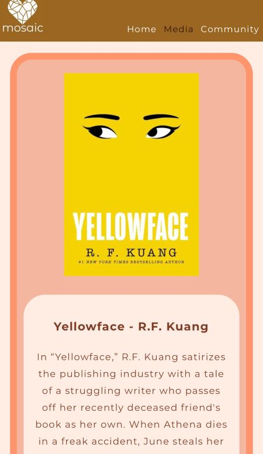
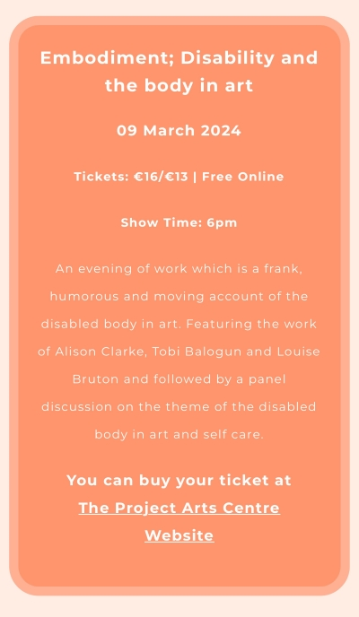

# Mosaic Media

## Overview

I created this site to act as a community and blog for reviewing and recommending art and media that celebrates inclusivity and diversity through LGBT+ and BIPOC writers and creators. I had the idea for this project when I first decided to pursue coding as I am a writer and musician as well as a proud member of both LGBT+ and BIPOC communities. All the material and media provided was selected by myself and my friends because we connected to this art in ways that guided our perspectives and provided support to our own issues and experiences. I wanted to use this idea for this project as it is a concept close to my heart, and I feel it reflects a kind of work I want to do within this industry in the future. I would love to be able to do what I can to create positive and inclusive change to the world around me through the technologies that we use.

[You can find the site here](https://fernvr.github.io/mosaic/)

## Contents

* [Overview](#overview)
* [User Experience (UX)](#user-experience-ux)
    * [User Stories](#user-stories)
        * [First Time Visitor Goals](#first-time-visitor-goals)
        * [Returning Visitor Goals](#returning-visitor-goals)
        * [Frequent User Goals](#frequent-user-goals)
* [Design](#design)
    * [Color Scheme](#colour-scheme)
    * [Typography](#typography)
    * [Imagery](#imagery)
    * [Effects](#effects)
    * [Design Choices](#design-choices)
    * [Wireframes](#wireframes)
* [Features](#features)
    * [Home Page](#home-page)
        * [Navigation Bar](#navigation-bar)
        * [Hero Image](#hero-image)
        * [Our Mission Section](#our-mission-section)
        * [Quote Section](#quote-section)
        * [Footer](#footer)
    * [Media Page](#media-page)
        * [Media Banner](#media-banner)
        * [Media Section](#media-section)
    * [Community Page](#community-page)
        * [Community Banner](#community-banner)
        * [Community Picks](#community-picks)
        * [Book Club Section](#book-club-section)
        * [Events Section](#events-section)
        * [Form Section](#form-section)
        * [Thank You Page](#thankyou-page)
    * [Future Features](#future-features)
* [Technologies Used](#technologies-used)
    * [Languages Used](#languages-used)
    * [Frameworks, Libraries & Programs Used](#frameworks-libraries--programs-used)
* [Testing](#testing)
    * [Validation](#validation)
    * [Lighthouse Testing](#lighthouse-testing)
    * [Further Testing](#further-testing)
        * [Test Grid](#test-grid)
    * [Fixed Bugs](#fixed-bugs)
    * [Known Bugs](#known-bugs)
* [Deployment](#deployment)
    * [Github Pages](#github-pages)
    * [Forking the GitHub Repository](#forking-the-github-repository)
    * [Making a Local Clone](#making-a-local-clone)
* [Credits](#credits)
    * [Code](#code)
    * [Content](#content)
    * [Media](#media)
* [Ackowledgements](#acknowledgements)

# User Experience (UX)

-   ### User Stories

    -   #### First Time Visitor Goals

        As a first time visitor, I want to:

        1. Easily understand the main purpose of the site and learn more about the community.
        2. Easily navigate throughout the site to find content I'm looking for.
        3. Look at the community page to see whats happening and who gets involved.

    -   #### Returning Visitor Goals

        As a returning visitor, I want to:

        1. Find more media and art to connect to.
        2. Find the best way to get in contact with the organisation with any questions I may have.
        3. Engage in the community page to find events I can attend or subscribe to the newsletter. 

    -   #### Frequent User Goals

        As a frequent user, I want to:

        1. Check if theres new content on the media page.
        2. See if there's any new events, demonstrations or blog posts added to the community page.
        3. Sign up to the Newsletter so that I am emailed any major updates and/or changes to the website or organisation.

# Design

## Colour Scheme

*   I wanted the colours to display a warm and neutral theme, with some brighter colours to add flare and art to the site.

    

## Typography

*   The Montserrat font is the main font used throughout the whole website with Sans Serif as the fallback font. Montserrat is a clean font and is both attractive and appropriate.

*   I varied between font weights and letter spacing for titles and written content, to make everything clear and easy to read.

## Imagery

*   I worked hard to make sure the imagery was consistent with the layout and theme for the site. I wanted the colours and images to have an artistic and minimal design theme as to not distract from the content.

    

*   The hero image was selected to provide an inviting introduction to the site using a spiral black and white mosaic photo to reflect the name of the site. 

    

*   Photos with text on them have darker overlay to ensure legibility to the text.

## Effects 

*   Hover styles added to all links and buttons so they change colour or display an underline when they're being highlighted to indicate they are clickable for a user.

    

## Design Choices 

*   The design is intentionally minimalistic, elegant and warm, to convery a soft, safe and cosy atmosphere for the site as providing a safe space for users is one of the main goals of the site. 

*   The layout and design of the website is consistent across all screen sizes.

## Wireframes

I didnt use any wireframe programmes. I started the project with a clear idea of what I wanted it to look like, then as I moved through the project I realised there were sections that were a bit too complex and took too much time to build. I then compressed the site a great deal to save on time, overall I think next time I will be using wireframes as it was quite time consuming to change each section. 
    
I did some sketches throughout the project of different parts which I've left here for your reference:
    
    
    
    

# Features

-   Responsive on all device sizes.

-   Interactive elements - hover styles on links and navigation.

-   Header with navigation is fixed on the top of the screen so users can easily navigate to different parts.

## Home Page

### Navigation Bar 

-   The logo on the top left is easy to locate and links to the home page landing banner to ensure easy navigation for a user.

-   Text is smaller on smaller screen sizes so the links all fit on the navigation bar nicely. 

-   On larger screen sizes, the navigation links display a growing underline when being higlighted as well as changing the color of the text to show a user the links are clickable.

-   Link of the page you're on will have a different colour text to show that a user is on that page.

    

### Hero Image 

-   The hero image is a spiralled black and white tiled mosaic design, to match the name and theme of the site. 

-   A black transparent overlay is used to enhance the contrast and make the text more legible.

    
    

### Our Mission Section 

-   Highlights a bief description, overview and origin of the site addressed to potetial users of the site to connect to site users.

-   There are three images displayed alongside the statement, displaying all 3, 2 or 1 depending on the screen size and how the statement fits.
(screenshot all 3 images and show how they look all displayed)

    
    
    

### Quote Section 

-   A meaningful quote about the importance of creativity, followed by a statment giving the user an option to subscribe to the monthly newsletter with links that take you to the form section. 

-   Links change colour when hovered to demonstrate they are clickable.

    
    

### Footer 

-   Contact information displayed with icon. (screenshot)

-   Social media links with the @ tag for the page shown below the links.

-   'don't hesitate to get in touch' statement at the bottom as a warm invitation for users to get involved.

    
    

## Media Page 

### Media Banner 

-   Inviting image with text overlay, with a darker opacity to ensure the text is readable. 

-   Heading used for quote on the banner, followed by a brief description of the page content and a navigation element separated by a border line. 

-   Navigation section has bolder font-weight to ensure the text is clear. Hover styles added to the links in the text to show a user can click on them.

    
    

### Media Section 

-   Headings of each section separate the content from the heading using a border line across the page. This is to show structure to the page.

-   Media boxes are a stand-out colour with clear contrast for accessibility purposes. 

-   Media boxes are styled with a border-radius of 2rem to give the look a softer and more inviting feeling. 

-   Links in each section to take you to another page to either purchase a book, stream an artist or watch a film/tv-series. 

    
    
    

## Community Page 

### Community Banner 

-   Similar styles to media banner in terms of the layout and the colour contrast, this is to maintain a consistent feel of the design across different pages. 

-   Image of a silhouette of a group of friends on top of a peak, this is to accomodate the overall theme of friendship and community on the page.

    

### Community Picks 

-   Similar styles to the media box, but without a description of the material. Instead it just displays the cover, title, author's name and the name and city of the person who submitted it.

-   Community picks boxes display next to each other on a larger screen so the section fits appropriately on a wider screen.

    
    

### Book Club Section 

-   A brief description of the club and what happens, accompanied by a image of the loction of the meeting spot on google maps, as well as an unordered list with all the detaila of the club and how to get involved. 

-   Contact information for the club-runner is displayed at the bottom with some motivational words to encourage users to get in touch. 

-   Mobile screens will have the information of the book club display one after the other, but on larger screens will display next to each other so the section fits nicely on a wide screen.

    
    

### Events Section 

-   Image of event, followed by information box containing a description, date, time and ticket information as well as a link to purchase the ticket.

-   Styled with bright and warm colours to match the images. 

-   Titles and important information are written with bolder font-weight to highlight that its important information. 

    
    
    
    

### Form Section 

-   Colour of form box is bright and inviting for a user. The box floats on a pretty image of a desk with a coffee cup and books on it. The colours in the photo match the colour pallete of the site.

-   White * star symbols are next to inputs that are required to fill out the form. 

-   The buttons have hover styles so the buttons change colour when being higlighted. 

    

### ThankYou Page

-   A user is redirected to thankyou.html page that shows text thanking the user for their submition as well as a link to 'Go back' to the homepage landing banner. 

-   Home page banner image of mosaic is used as the background image for the thank you page, this is to keep to the theme of the site and enforce the branding. 

    
    

## Future Features

I planned to include versions of these features in the original structure, but decided to exclude them for this project and focus more on the media and art sections to keep to MVP standards and also not over complicate or clutter the webpage.

-   A blog page, where a group of writers contribute their work such as think pieces, historical or scientific essays or local/inernational news stories. 

-   Reviews, the current media page will have an option to click to a full review of the material, as well as the brief description. This is so users have the option to only read some of the description and avoid any spoilers. The reviews would be targetted at users who have already engaged in this material and a spoilers warning will show. 

-   An Activist section that activism groups can use to advertise and organise demonstrations, protests or fundraisers. This section would also contain any political/government news and movements, changes in legistlation and upcoming election information.

# Technologies Used

## Languages Used

-   [HTML5](https://en.wikipedia.org/wiki/HTML5)
-   [CSS3](https://en.wikipedia.org/wiki/Cascading_Style_Sheets)

## Frameworks, Libraries & Programs Used

1. [Google Fonts:](https://fonts.google.com/)
    - Google fonts were used to import the 'Titillium Web' font into the style.css file which is used on all pages throughout the project.

1. [Font Awesome:](https://fontawesome.com/)
    - Font Awesome was used on all pages throughout the website to add icons for aesthetic and UX purposes.

1. [Git](https://git-scm.com/)
    - Git was used for version control by utilizing the Gitpod terminal to commit to Git and Push to GitHub.

1. [GitHub:](https://github.com/)
    - GitHub is used to store the projects code after being pushed from Git.

1. [Design.com:](https://design.com/)
    - Design.com was used to generate the logo.

1. [Sketchbook:](https://sketchbook.com/)
    - Sketchpad was used to edit the logo.

1. [ColorSpace:](https://mycolor.space/)
    - ColorSpace was used to generate the colour palletes for the site.

1. [Numbers:](https://apple.com/numbers/)
    - I used the Numbers app on my iPad pro to create my test grid spreadsheets.

1. [Notes:](https://apple.com/notes/)
    - I used the apple notes app on both my iPad and my iPhone for sketches, or any other planning/checklists used for this project.

# Testing

## Validation

The W3C Markup Validator and W3C CSS Validator Services were used to validate every page of the project to ensure there were no syntax errors in the project.

-   [W3C Markup Validator](https://jigsaw.w3.org/css-validator/#validate_by_input) - Received No errors/warnings for each page, Home, Media and Community.
    
    
-   [W3C CSS Validator](https://jigsaw.w3.org/css-validator/#validate_by_input)
    
    

## Lighthouse Testing

## Further Testing

### Test Grid 

I created a testing grid on Apple Numbers which I used throughout the process of building this site. The grids have categories for each link/button to ensure all of them work correctly and redirect to a new tab if needed. There is also a grid to test responsive design for each section of the page, the different sections are outlined below. I included a screenshot of a blank grid to show the template I used during the project, as I have fixed anything broken from my previous grid. 

-   The Website was tested on Google Chrome, Internet Explorer, Microsoft Edge and Safari browsers.

-   The website was viewed and tested on a variety of devices such as Desktop, Laptop, iPhone 10, iPhone 12, iPhone 14 Pro and iPad Pro. (screenshot of each one with title + landscape view)

-   A large amount of testing was done to ensure that all pages were linking correctly, as well as buttons and form submition and inputs. (screenshot of all tests on   form)

-   I also did a good amount of testing the responsiveness of the website on different phone screens vertical and horizontal view, to make sure all the images and text are the correct size and position.

-   Friends and family members were asked to review the site and documentation to point out any bugs or user experience issues.

-   Tested on all devices available on chrome dev tools.

## Fixed Bugs 

Throughout the process of building this site, I came across many different errors, bugs or warnings that I have since fixed. Mostly syntax/spelling errors, as well as a few issues trying to navigate flexbox. The html validators were a good tool in identifying any errors with syntax or otherwise, and I was able to fix all the issues that the validator identified to end with a good result. I am hoping that there aren't anymore unknown bugs I haven't found/fixed!

## Known Bugs

-   Background Images on mobile screens appear pixelated since I reduced the size of the images due to lower performance. I've tried reducing the size with different methods to solve this issue, but I've had no luck. I could have kept the larger images but it was slowing down the site and I couldn't get the lighthouse performance score to improve while using the large images. 

-   There is an issue with the underline hover style on the navigation, this is because of an issue with the size/padding/margin that I haven't been able to identify or rectify. The underline appears too large on both home and media links, on the community link it fits.

-   A white border displays when I try to view the site on landscape mode on my phone. I have tested on other devices and it seems to be only my phone (iphone 12 Pro) that is having this issue.

# Deployment

## GitHub Pages

The project was deployed to GitHub Pages using the following steps:

1. Log in to GitHub and locate the [GitHub Repository](https://github.com/)
2. At the top of the Repository, locate the "Settings" Button on the menu.
3. Scroll down the Settings page until you locate the "GitHub Pages" Section.
4. Under "Source", click the dropdown called "None" and select "Master Branch".
5. The page will automatically refresh.
6. Scroll back down through the page to locate the now published site in the "GitHub Pages" section.

## Forking the GitHub Repository

By forking the GitHub Repository we make a copy of the original repository on our GitHub account to view and/or make changes without affecting the original repository by using the following steps...

1. Log in to GitHub and locate the [GitHub Repository](https://github.com/)
2. At the top of the Repository (not top of page) just above the "Settings" Button on the menu, locate the "Fork" Button.
3. You should now have a copy of the original repository in your GitHub account.

## Making a Local Clone

1. Log in to GitHub and locate the [GitHub Repository](https://github.com/)
2. Under the repository name, click "Clone or download".
3. To clone the repository using HTTPS, under "Clone with HTTPS", copy the link.
4. Open Git Bash
5. Change the current working directory to the location where you want the cloned directory to be made.
6. Type `git clone`, and then paste the URL you copied in Step 3.

# Credits

## Code

-   The hover styles for the navigation to display the underline when highlighted were taken from [GreatStack tutorial](https://www.youtube.com/watch?v=PgAZ8KzfhO8)

## Content

-   Some media sections have descriptions taken from these sites: [Electric Lit](https://electricliterature.com/), [The Guardian](https://www.theguardian.com/europe), [Pink News](https://www.thepinknews.com/) and [Conversations about her](https://conversationsabouther.net/) as well as [Wikipedia](https://www.wikipedia.org/). 

-   The events from the event section of the community page were copied from [The Project Arts Centre Website](https://projectartscentre.ie/). 

## Media

-   Images were taken from [Unsplash](https://unsplash.com/), the images used for the media sections were the posters taken from [Google Images](https://images.google.com/). 

-   Images for events section were taken from [The Project Arts Centre Website](https://projectartscentre.ie/) and [Google Images](https://images.google.com/)

-   The map on the Book Club section of the community page is a screenshot from [Google Images](https://images.google.com/).

    

# Acknowledgements

I would like to express my gratitute to my mentor for continuous helpful feedback, advice and resources. Tutor support at Code Institute for their support, as well as the Slack Community, and my class group for always replying to my messages within minutes of being sent! I would also like to thank Code Institute for all the course material I've read and re-read during this process.

